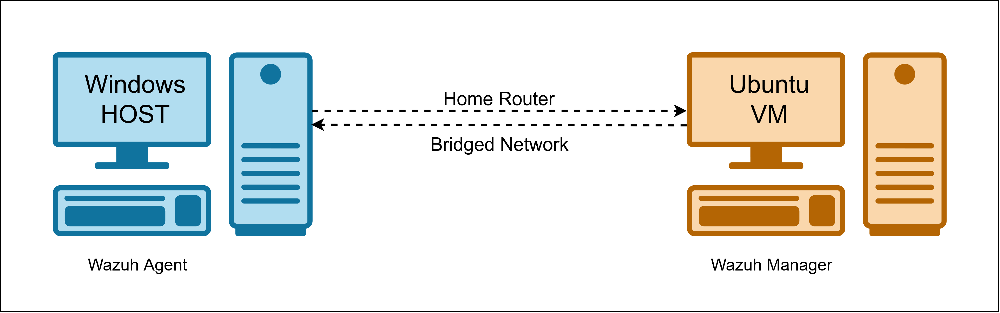

# Wazuh SIEM & File Integrity Monitoring Lab

## Overview

My objective with this lab is to build a practical **Security Operations Center (SOC) monitoring environment using Wazuh as a SIEM** and understand how security monitoring works in a real-world environment. I want to learn how to deploy and configure a SIEM, onboard and monitor a Windows endpoint, collect and analyze security telemetry, implement **File Integrity Monitoring (FIM)**, and investigate alerts generated from controlled security events. Through this lab, I aim to develop hands-on skills in **security event monitoring, alert triage, detection validation, incident investigation, troubleshooting, and security documentation**, while building a strong foundation for more advanced SOC activities such as detection engineering, vulnerability management, SOAR automation, and EDR-based response.

## Lab Architecture

### System Requirements

| Component | Requirement |
|-----------|-------------|
| RAM | Minimum 8 GB |
| Hypervisor | VirtualBox (free) |
| Host OS | Windows (for agent) |
| Guest OS | Ubuntu VM (for manager) |

### Network Diagram



**Network Configuration:**
- Ubuntu VM uses **bridged network adapter**
- Both machines on same subnet: `192.168.0.0/24`
- Two-way communication required between agent and manager

---

## Installation Steps

### Step 1: Install Wazuh Manager on Ubuntu

#### 1.1 Add Wazuh GPG Key

```bash
curl -s https://packages.wazuh.com/key/GPG-KEY-WAZUH | \
sudo gpg --no-default-keyring --keyring gnupg-ring:/usr/share/keyrings/wazuh.gpg --import && \
sudo chmod 644 /usr/share/keyrings/wazuh.gpg
```

#### 1.2 Add Wazuh Repository

```bash
echo "deb [signed-by=/usr/share/keyrings/wazuh.gpg] https://packages.wazuh.com/4.x/apt/ stable main" | \
sudo tee -a /etc/apt/sources.list.d/wazuh.list
```

#### 1.3 Update and Install

```bash
sudo apt-get update
sudo apt-get install wazuh-manager
```

**Installation Time:** ~10 minutes

**Installed Components:**
- Wazuh Indexer
- Wazuh Server
- Wazuh Dashboard
- Filebeat

#### 1.4 Access the Dashboard

After installation completes, you'll see credentials in the terminal:

```
You can now access the web interface on port 443
Username: admin
Password: <generated-password>
```

Navigate to: `https://<ubuntu-ip-address>` (e.g., `https://192.168.0.217`)

**Note:** Accept the self-signed certificate warning in your browser.

---

### Step 2: Install Wazuh Agent on Windows

#### 2.1 Download the Agent

1. Visit [Wazuh Downloads](https://packages.wazuh.com/4.x/windows/)
2. Download the Windows installer (`.msi` file)
3. Run the installer with administrator privileges

#### 2.2 Configure Agent Connection

During installation, you'll be prompted for:
- **Manager IP Address:** `192.168.0.217` (your Ubuntu VM IP)
- **Authentication Key:** (generated in next step)

---

### Step 3: Register the Agent on Wazuh Manager

#### 3.1 Add Agent via CLI

On your Ubuntu VM, run:

```bash
sudo /var/ossec/bin/manage_agents
```

**Menu Options:**
1. Select `A` (Add an agent)
2. Enter agent name: `Windows-agent`
3. Enter agent IP: `192.168.0.35`
4. Confirm addition

**Output:**
```
Agent ID assigned: 001
```

#### 3.2 Extract Authentication Key

1. Select `E` (Extract key for an agent)
2. Enter agent ID: `001`
3. Copy the generated key

#### 3.3 Add Key to Windows Agent

1. Open Wazuh Agent GUI on Windows
2. Paste the authentication key
3. Restart the Wazuh Agent service:
   - Open Wazuh Agent Manager
   - Click **Manage** → **Restart**

#### 3.4 Verify Agent Connection

On the Wazuh Dashboard:
- Navigate to **Agents** section
- You should see `Windows-agent` listed as **Active**
- Click on the agent to view logs and events

---

## File Integrity Monitoring (FIM) Setup

### What is FIM?

File Integrity Monitoring detects and logs:
- File creation
- File deletion
- File modifications
- Permission changes

### Step 4: Configure FIM on Windows Agent

#### 4.1 Edit Agent Configuration

1. Open **Notepad as Administrator**
2. Navigate to: `C:\Program Files (x86)\ossec-agent\ossec.conf`
3. Locate the `<syscheck>` section (File Integrity Monitoring)

#### 4.2 Add Custom Directory to Monitor

Add the following line inside the `<syscheck>` section:

```xml
<directories check_all="yes" realtime="yes">C:\Wazuh-Test</directories>
```

**Example Configuration:**

```xml
<syscheck>
  <disabled>no</disabled>
  <frequency>43200</frequency>
  <directories check_all="yes" realtime="yes">C:\Wazuh-Test</directories>
  <directories check_all="yes" realtime="yes">C:\Windows\SysWOW64</directories>
  <directories check_all="yes" realtime="yes">C:\Windows\System32</directories>
</syscheck>
```

#### 4.3 Save and Restart

1. Save the configuration file (`Ctrl+S`)
2. Restart the Wazuh Agent service

---

### Step 5: Test File Integrity Monitoring

#### 5.1 Create a Test File

1. Navigate to `C:\Wazuh-Test`
2. Create a new text file: `test1.txt`
3. Save the file

#### 5.2 Verify in Wazuh Dashboard

1. Go to **Wazuh Dashboard** → **File Integrity Monitoring**
2. Refresh the page
3. You should see an event:
   - **Event Type:** File added
   - **File Name:** `C:\Wazuh-Test\test1.txt`
   - **Timestamp:** Current time
   - **Agent:** Windows-agent

#### 5.3 Delete the Test File

1. Delete `test1.txt` from `C:\Wazuh-Test`

#### 5.4 Verify Deletion Event

1. Refresh the FIM dashboard
2. You should see:
   - **Event Type:** File deleted
   - **File Name:** `C:\Wazuh-Test\test1.txt`

---

## Configuration Files Reference

### Wazuh Agent (Windows)

**Location:** `C:\Program Files (x86)\ossec-agent\ossec.conf`

**Key Sections:**
```xml
<!-- Manager Connection -->
<client>
  <server>
    <address>192.168.0.217</address>
    <port>1514</port>
    <protocol>tcp</protocol>
  </server>
</client>

<!-- File Integrity Monitoring -->
<syscheck>
  <directories check_all="yes" realtime="yes">C:\Wazuh-Test</directories>
</syscheck>

<!-- Log Collection -->
<localfile>
  <log_format>eventlog</log_format>
  <log_format>syslog</log_format>
</localfile>
```

### Wazuh Manager (Ubuntu)

**Key Directories:**
- `/var/ossec/etc/` - Configuration files
- `/var/ossec/logs/` - Log files
- `/var/ossec/rules/` - Custom rules
- `/var/ossec/decoder/` - Log decoders

---

## Troubleshooting

### Agent Not Connecting

1. **Check Network Connectivity:**
   ```bash
   ping 192.168.0.217  # From Windows
   ping 192.168.0.35   # From Ubuntu
   ```

2. **Verify Firewall Rules:**
   - Ensure port `1514` (TCP/UDP) is open on Ubuntu
   - Ensure port `443` is open for dashboard access

3. **Check Agent Status:**
   ```powershell
   # Windows PowerShell (Admin)
   Get-Service -Name wazuh
   Restart-Service -Name wazuh
   ```

4. **Verify Manager Status:**
   ```bash
   # Ubuntu terminal
   sudo systemctl status wazuh-manager
   sudo systemctl restart wazuh-manager
   ```

### FIM Not Working

1. Ensure `<syscheck>` section is not disabled
2. Verify directory path is correct
3. Restart the agent service after configuration changes
4. Check agent logs: `C:\Program Files (x86)\ossec-agent\ossec.log`

---

## Quick Reference Commands

### Ubuntu (Wazuh Manager)

```bash
# Check manager status
sudo systemctl status wazuh-manager

# Restart manager
sudo systemctl restart wazuh-manager

# Manage agents
sudo /var/ossec/bin/manage_agents

# View logs
sudo tail -f /var/ossec/logs/ossec.log

# Check open ports
sudo netstat -tulpn | grep 1514
```

### Windows (Wazuh Agent)

```powershell
# Check agent status
Get-Service -Name wazuh

# Restart agent
Restart-Service -Name wazuh

# View agent logs
Get-Content "C:\Program Files (x86)\ossec-agent\ossec.log" -Tail 50
```
